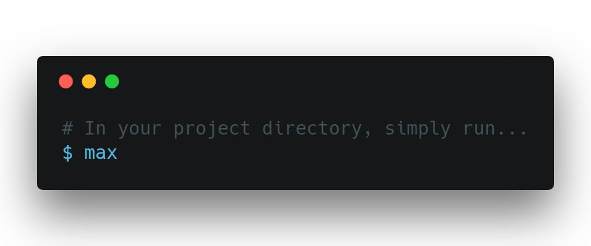

# s3d
🚀 Deploy static websites quickly and easily to AWS S3! 

**Disclaimer:** _This is a concept. Not an actual project. At least, at this point_

## Deploy a Static Site

Deploy a static site in three keystrokes! 

## Requirements

- **Fast** From first keystroke to live website!
- **Simple:** One command deployment
- **Cheap:** Free or basically free
- **Secure:** Always secured with TLS

### Components

There will be two components to this project. 

#### The CLI

The command line interface will be the primary means of deploying websites. It will be simple but feature complete. The CLI will also supersede [RVA-CLI](https://filiosoft.net/rva-cli), so it has to provide the same functionality as RVA. 

#### The API

The API will serve as a sort of proxy to S3. It will provide authentication so that just any user can't publish to your website. The biggest challenge to this piece will be scalability. The API has to be able to proxy 100's of file uploads at once. The API will also handle provisioning of new buckets and CDNs. 

### Flow

1. Developer runs `s3d`
2. `s3d` checks that it has permission to deploy this site
3. `s3d` compresses the site
4. `s3d` uploads the compressed site to the API
5. API receives the upload (checks users's permissions)
6. Concurrently, API does these
   - API decompresses the site
   - API creates an S3 bucket (if it doesn't exist)
7. Concurrently, API does these
   - API provisions CDN for the new S3 bucket (if it doesn't exist)
   - API uploads files to the new S3 bucket
8. API responds to `s3d` with the new site's address

### Tools & Language

See [#1](https://github.com/Filiosoft/s3d/issues/1).

## Name

Currently, we have named this project `s3d`. That is an incredibly boring name. It stands for S3 Deploy. Again, very boring. We would love to give it a new name that sounds good. If you have an idea, feel free to comment on issue [#2](https://github.com/Filiosoft/s3d/issues/2)! These are the requirements for the name:

- Short. Less than 5 characters. The shorter the better.
- Available on [NPM](https://npmjs.com). 
- Available domain name. (That sounds good)
- Shouldn't conflict with any preinstalled binaries

## Inspiration
Inspiration for this project comes from thses projects:

- [Surge.sh](https://surge.sh)
- [Zeit's](https://zeit.co) [Now](https://zeit.co/now)